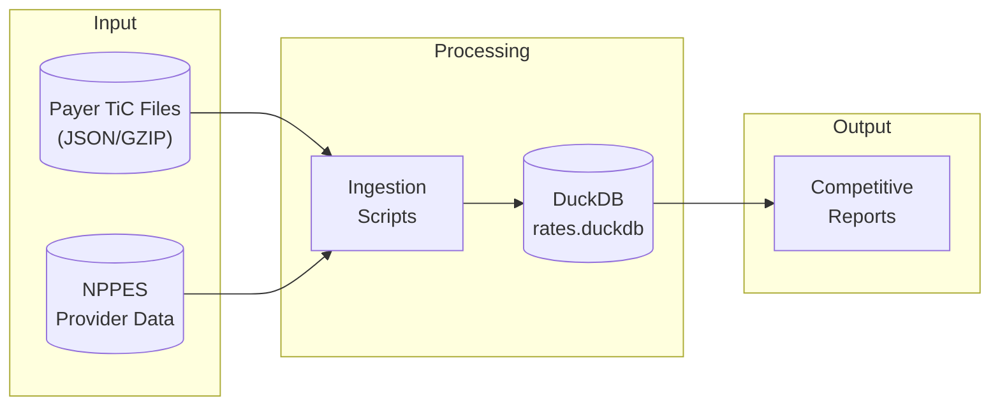
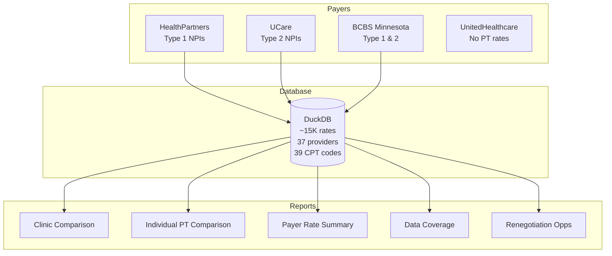
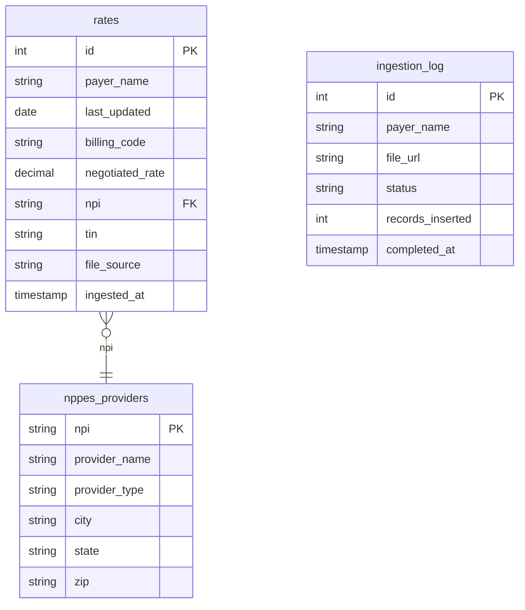

# Physical Therapy Market Rate Analysis

Competitive rate intelligence for PT contract negotiations using Transparency in Coverage data.

---

## Overview

This tool ingests negotiated rate data from health insurance payers and generates competitive analysis reports for physical therapy providers in the Saint Paul metro area.

**What it does:**
- Extracts PT-specific rates from payer Transparency in Coverage (TiC) files
- Compares Maverick Physiotherapy rates against 36 local competitors
- Identifies renegotiation opportunities where rates are below market median
- Generates markdown reports for easy sharing

---

## Architecture



---

## Data Flow



---

## Quick Start

```bash
# Clone and setup
git clone https://github.com/your-repo/mason_pt_data.git
cd mason_pt_data

# Create virtual environment
python -m venv .venv
source .venv/bin/activate

# Install dependencies
pip install -e .

# Generate reports (after data is ingested)
python scripts/generate_competitive_report.py
```

---

## Project Structure

```
mason_pt_data/
├── README.md
├── AGENTS.md                 # AI agent instructions
├── pyproject.toml
│
├── config/
│   ├── cpt_codes.yaml        # 39 PT CPT codes to extract
│   └── payers.yaml           # Payer configurations
│
├── scripts/
│   ├── generate_competitive_report.py   # Main report generator
│   ├── ingest_bcbs_local.py             # BCBS data ingestion
│   ├── scan_bcbs_groups.py              # BCBS provider group scanner
│   └── load_mn_nppes.py                 # Load provider NPIs
│
├── src/
│   ├── config.py             # Configuration loader
│   ├── parser.py             # TiC file parser
│   └── storage.py            # DuckDB storage layer
│
├── data/                     # (gitignored)
│   ├── rates.duckdb          # Main database
│   └── bcbs_npi_to_groups.json
│
├── reports/                  # (gitignored) Generated reports
└── logs/                     # (gitignored) Ingestion logs
```

---

## Reports Generated

| Report | Description |
|--------|-------------|
| `local_competitor_rates_by_clinic.md` | Maverick vs competitor clinics (Type 2 NPIs) |
| `local_competitor_rates_by_individual.md` | Mason/Eric vs individual PTs (Type 1 NPIs) |
| `median_payer_rates_by_cpt_code.md` | Rate summary across all payers |
| `underlying_data_summary.md` | Data coverage and limitations |
| `renegotiation_opportunities.md` | Rates below market median |

---

## Payer Coverage

| Payer | Status | Notes |
|-------|--------|-------|
| BCBS Minnesota | Ingested | Complex ingestion via provider group mapping |
| HealthPartners | Ingested | Direct NPI match, Type 1 only |
| UCare | Ingested | Direct NPI match, Type 2 only |
| UnitedHealthcare | Not available | NPIs exist but not linked to PT rates |
| Medica | Not ingested | Bot protection |
| Cigna | Not ingested | Bot protection |
| Medicare/Medicaid | Not ingested | Different data format |

---

## Key NPIs

| Provider | NPI | Type |
|----------|-----|------|
| Maverick Physiotherapy LLC | `1073185393` | Organization |
| Mason Richlen DPT, PT | `1326610783` | Individual |
| Eric Niemyer DPT, PT | `1699341354` | Individual |

---

## Database Schema



---

## Data Ingestion

### Step 1: Load Provider NPIs
```bash
python scripts/load_mn_nppes.py
```

### Step 2: Ingest BCBS (requires group scan first)
```bash
# One-time: scan provider groups
python scripts/scan_bcbs_groups.py

# Ingest rates
nohup python scripts/ingest_bcbs_local.py > logs/bcbs_local.log 2>&1 &
tail -f logs/bcbs_local.log
```

### Step 3: Generate Reports
```bash
python scripts/generate_competitive_report.py
```

---

## Sample Output

Renegotiation Opportunities:
```
Payer              CPT     Description            Maverick's Rate   Payer Median   % Below
─────────────────────────────────────────────────────────────────────────────────────────
BCBS Minnesota     97110   Therapeutic exercises  $18.50            $20.48         -9.7%
HealthPartners     97161   PT eval low            $78.00            $92.00         -15.2%
UCare              97530   Therapeutic activities $34.00            $38.00         -10.5%
```

---

## Tech Stack

- **Python 3.11+** - Core language
- **DuckDB** - Fast analytical database
- **httpx** - HTTP client for API calls
- **Rich** - Terminal output formatting
- **ijson** - Streaming JSON parser for large files
