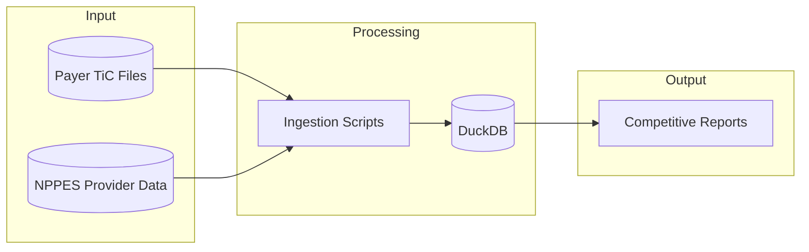
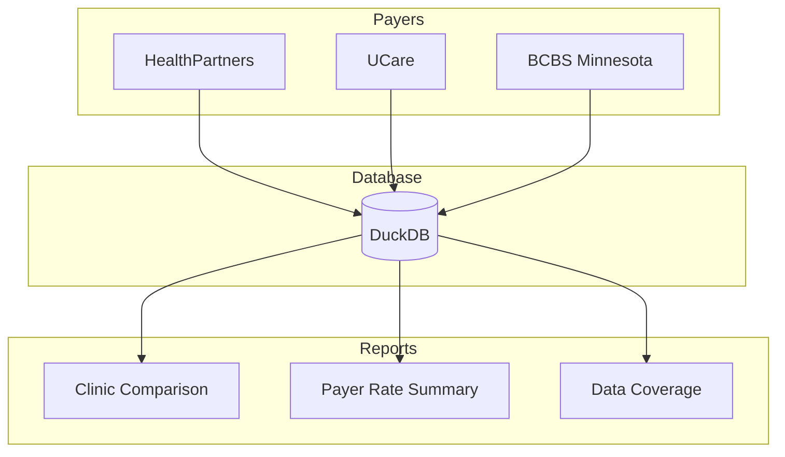
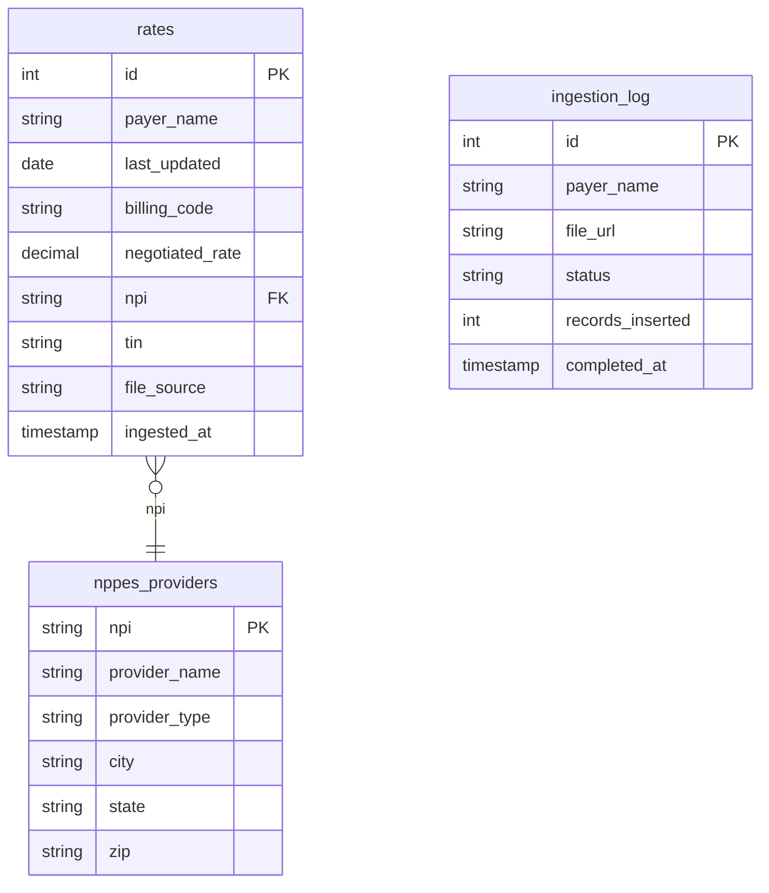

# Physical Therapy Market Rate Analysis

Competitive rate intelligence for PT contract negotiations using Transparency in Coverage data.

---

## Overview

This tool ingests negotiated rate data from health insurance payers and generates competitive analysis reports for physical therapy providers in your local market.

**What it does:**
- Extracts PT-specific rates from payer Transparency in Coverage (TiC) files
- Compares your practice's rates against local competitors
- Identifies renegotiation opportunities where rates are below market median
- Generates CSV reports for easy sharing and analysis

---

## Architecture



---

## Data Flow



---

## Quick Start

```bash
# Clone and setup
git clone https://github.com/2016judea/Physical-Therapy-Market-Analysis.git
cd Physical-Therapy-Market-Analysis

# Create virtual environment
python -m venv .venv
source .venv/bin/activate

# Install package
pip install -e .

# Interactive setup - configure your NPIs and location
tic init

# Run full ingestion pipeline
tic ingest

# Generate competitive analysis reports
tic report

# Check status anytime
tic status
```

---

## Project Structure

```
pt_rate_analysis/
├── README.md
├── AGENTS.md                 # AI agent instructions
├── pyproject.toml
│
├── config/
│   ├── cpt_codes.yaml        # PT CPT codes to extract
│   └── payers.yaml           # Payer configurations
│
├── scripts/
│   ├── generate_competitive_report.py   # Main report generator
│   ├── ingest_healthpartners.py         # HealthPartners data ingestion
│   ├── ingest_ucare.py                  # UCare data ingestion
│   ├── ingest_bcbs_local.py             # BCBS data ingestion
│   ├── scan_bcbs_groups.py              # BCBS provider group scanner
│   └── load_mn_nppes.py                 # Load provider NPIs
│
├── src/
│   ├── config.py             # Configuration loader
│   ├── parser.py             # TiC file parser
│   └── storage.py            # DuckDB storage layer
│
├── data/                     # (gitignored)
│   ├── rates.duckdb          # Main database
│   └── bcbs_npi_to_groups.json
│
├── reports/                  # (gitignored) Generated reports
└── logs/                     # (gitignored) Ingestion logs
```

---

## Reports Generated

| Report | Description |
|--------|-------------|
| `clinic_competitive_comparison.csv` | Primary clinic vs competitor clinics by CPT code |
| `payer_rates_by_cpt.csv` | Rate summary across all payers |
| `clinic_data_summary.csv` | Data coverage per clinic/payer |

---

## Payer Coverage

| Payer | Status | Notes |
|-------|--------|-------|
| BCBS Minnesota | ✅ Supported | Complex ingestion via provider group mapping; uses both Type 1 and Type 2 NPIs |
| UCare | ✅ Supported | TOC index file, Type 2 NPIs only |
| HealthPartners | ✅ Supported | Type 1 NPIs only; aggregated to clinic level via npi_groups mapping |
| UnitedHealthcare | ⚠️ Not usable | NPIs exist in files but not linked to PT rate entries |
| Aetna | ❌ Not supported | National payer with HealthSparq portal; complex file structure |
| Medica | ❌ Not supported | HealthSparq portal with bot protection |
| Cigna | ❌ Not supported | Browser automation required; CAPTCHA protection |
| Humana | ❌ Not supported | Bot protection and CAPTCHA requirements |
| Medicare/Medicaid | ❌ Not supported | CMS/DHS publish separately in different formats |

---

## Configuration

Run `tic init` to configure your practice NPIs and geographic area interactively. This stores your settings in `data/user_config.json`:

- **Clinic NPI** - Your practice's Type 2 (organization) NPI
- **Individual NPIs** - Type 1 NPIs for individual providers
- **Zip Prefixes** - 3-digit prefixes to filter local competitors (e.g., `551` for Saint Paul, `554` for Minneapolis)
- **Practice Name** - Used in report headers

---

## Database Schema



---

## CLI Reference

The `tic` command provides a unified interface for the entire pipeline:

| Command | Description |
|---------|-------------|
| `tic init` | Interactive setup - configure NPIs and zip prefixes |
| `tic ingest` | Run full data ingestion for all payers |
| `tic ingest -p ucare` | Ingest specific payer only |
| `tic ingest --skip-bcbs` | Skip BCBS (faster, excludes slow ingestion) |
| `tic report` | Generate competitive analysis reports |
| `tic status` | Show database statistics and configuration |
| `tic reset` | Delete all data and start fresh |

### Example Session

```bash
$ tic init
PT Rate Analysis - Initial Setup

Primary clinic NPI (Type 2): 1234567890
Enter individual provider NPIs (empty line to finish):
  Add NPI: 1111111111
  Add NPI: 2222222222
  Add NPI: 
Zip prefixes (comma-separated) [551]: 551, 553
Practice name (for reports) [Our Practice]: ABC Physical Therapy

✓ Configuration saved!
Load local provider data from NPPES now? [Y/n]: y
```

---

## Manual Data Ingestion

If you prefer running scripts directly instead of the CLI:

### Step 1: Load Provider NPIs
```bash
python scripts/load_mn_nppes.py
```
Fetches physical therapists from the NPPES API for your configured zip prefixes and loads them into the database.

### Step 2: Ingest Payer Data

#### HealthPartners (fast)
```bash
python scripts/ingest_healthpartners.py
```
Downloads ZIP files directly. Type 1 NPIs aggregated to clinic level.

#### UCare (fast)
```bash
python scripts/ingest_ucare.py
```
Fetches TOC index and downloads MRF files. Type 2 NPIs only.

#### BCBS Minnesota (slow, ~2-4 hours)
```bash
# One-time: scan provider groups to map NPIs to group IDs
python scripts/scan_bcbs_groups.py

# Ingest rates from Local files
nohup python scripts/ingest_bcbs_local.py > logs/bcbs_local.log 2>&1 &
tail -f logs/bcbs_local.log
```
BCBS requires a two-phase approach: first scanning provider group files to find which groups contain your NPIs, then ingesting rates from "Local" network files.

### Step 3: Generate Reports
```bash
python scripts/generate_competitive_report.py
```

---

## Sample Output

### Clinic Competitive Comparison (CSV)
```
cpt_code,your_rate,market_median,percentile,rank,total_clinics,lowest_rate,highest_rate
97110,45.00,42.50,65,8,24,35.00,55.00
97140,48.00,46.00,58,10,24,38.00,58.00
```

### Payer Rate Summary (CSV)
```
cpt_code,description,bcbs_minnesota_median,healthpartners_median,ucare_median
97110,Therapeutic exercises,44.50,38.00,41.00
97140,Manual therapy,47.00,42.00,45.00
97161,PT eval low complexity,85.00,78.00,82.00
```

---

## Tech Stack

- **Python 3.11+** - Core language
- **DuckDB** - Fast analytical database
- **httpx** - HTTP client for API calls
- **Rich** - Terminal output formatting
- **ijson** - Streaming JSON parser for large files
